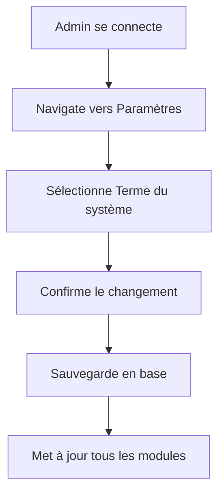
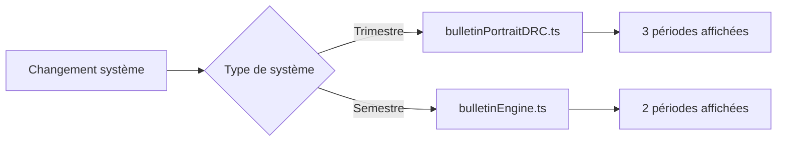

# Système de Termes Adaptatif

## 🎯 Objectif

Implémenter un système flexible qui permet aux établissements de choisir entre un système de **trimestres (3 termes)** pour les écoles primaires et un système de **semestres (2 termes)** pour les écoles secondaires, avec adaptation automatique de tous les modules concernés.

## 🏗️ Architecture

### Backend

#### 1. Modèle de données (School)
```javascript
// backend/src/modules/schools/school.model.js
settings: {
  gradeScale: { type: Number, default: 20, enum: [20, 100] },
  trimesters: { type: Number, default: 3, enum: [2, 3] },
  termSystem: { type: String, default: 'trimester', enum: ['trimester', 'semester'] },
  language: { type: String, default: 'fr', enum: ['fr', 'en'] },
  currency: { type: String, default: 'XOF' },
  timezone: { type: String, default: 'Africa/Kinshasa' }
}
```

#### 2. API Endpoint
```
PUT /api/schools/current/term-system
Body: { termSystem: "trimester" | "semester" }
Response: { termSystem, trimesters, message }
```

#### 3. Contrôleur
- Validation du système de termes
- Mise à jour automatique du nombre de périodes
- Gestion des erreurs et validation

### Frontend

#### 1. Types TypeScript
```typescript
// src/types/school.types.ts
export type TermSystem = "trimester" | "semester";

export interface SchoolSettings {
  gradeScale: number;
  trimesters: number;
  termSystem: TermSystem; // Nouveau champ
  language: SchoolLanguage;
  currency: string;
  timezone: string;
}
```

#### 2. Gestionnaire de système
```typescript
// src/lib/termSystemManager.ts
export class TermSystemManager {
  static getInstance(): TermSystemManager
  getCurrentTermSystem(): TermSystem
  isTrimesterSystem(): boolean
  isSemesterSystem(): boolean
  getPeriodCount(): number
  getPeriodNames(): string[]
  // ...
}
```

#### 3. Hook React
```typescript
// src/hooks/useTermSystem.ts
export function useTermSystem() {
  return {
    termSystem,
    isTrimesterSystem,
    isSemesterSystem,
    periodCount,
    periodNames,
    systemName,
    systemDescription
  };
}
```

#### 4. Moteur de bulletins intelligent
```typescript
// src/lib/smartBulletinEngine.ts
export class SmartBulletinEngine {
  static async generateBulletin(data: BulletinData): Promise<void> {
    const termSystem = termSystemManager.getCurrentTermSystem();
    
    if (termSystem === 'trimester') {
      return generatePortraitDRCBulletin(data); // 3 trimestres
    } else {
      return generateBulletinGenericPDF(data); // 2 semestres
    }
  }
}
```

## 🎛️ Interface d'administration

### Localisation
**Paramètres → Général → Paramètres académiques**

### Champs
- **Terme du système** (Select)
  - Trimestre (3 termes) - Adapté aux écoles primaires
  - Semestre (2 termes) - Adapté aux écoles secondaires

### Validation et avertissements
- Dialogue de confirmation avec impact détaillé
- Avertissement sur les modules affectés
- Recommandation de sauvegarde

## 🔄 Flux de fonctionnement

### 1. Configuration initiale


### 2. Adaptation automatique


## 📦 Modules impactés

### 1. Bulletins
- **Trimestre**: Utilise `bulletinPortraitDRC.ts`
- **Semestre**: Utilise `bulletinEngine.ts`
- Changement automatique du moteur de génération

### 2. Saisie des notes
- Adaptation du nombre de périodes dans les formulaires
- Mise à jour des sélecteurs de trimestres/semestres

### 3. Calculs et moyennes
- Ajustement des formules selon le système
- Mise à jour des coefficients et pondérations

### 4. Rapports et exports
- Adaptation des templates de rapports
- Mise à jour des périodes dans les exports

### 5. Interface utilisateur
- Sélecteurs adaptatifs (`PeriodSelector`)
- Affichage conditionnel des options

## 🛠️ Composants réutilisables

### PeriodSelector
```typescript
<PeriodSelector 
  value={selectedPeriod}
  onValueChange={setSelectedPeriod}
  placeholder="Sélectionner une période"
/>
```

### useTermSystem Hook
```typescript
const { 
  termSystem, 
  isTrimesterSystem, 
  periodCount, 
  periodNames 
} = useTermSystem();
```

## 🔧 Migration et changement

### Procédure de changement
1. **Validation**: Vérifier si le changement est autorisé
2. **Avertissement**: Afficher l'impact sur les modules
3. **Confirmation**: Exiger une confirmation explicite
4. **Migration**: Mettre à jour les données existantes
5. **Notification**: Informer les utilisateurs du changement

### Gestion des données existantes
- **Preservation**: Les notes existantes sont préservées
- **Recalcul**: Les moyennes sont recalculées si nécessaire
- **Historique**: Conservation d'un historique des changements

## 🧪 Tests et validation

### Tests unitaires
- Validation du type `TermSystem`
- Tests du `TermSystemManager`
- Tests du hook `useTermSystem`

### Tests d'intégration
- Changement de système en base de données
- Génération de bulletins avec les deux systèmes
- Adaptation des composants UI

### Tests manuels
- Navigation dans l'interface d'administration
- Vérification de l'adaptation des modules
- Validation des rapports générés

## 📚 Documentation utilisateur

### Guide administrateur
1. **Accès**: Paramètres → Général → Paramètres académiques
2. **Sélection**: Choisir "Trimestre" ou "Semestre"
3. **Confirmation**: Lire l'avertissement et confirmer
4. **Vérification**: Vérifier l'adaptation des modules

### Impact expliqué
- **Bulletins**: Le type de bulletin change automatiquement
- **Périodes**: Le nombre de périodes s'adapte
- **Calculs**: Les formules s'ajustent au système

## 🚀 Déploiement

### Backend
1. Mettre à jour le modèle `School`
2. Déployer le nouvel endpoint `/term-system`
3. Mettre à jour le contrôleur

### Frontend
1. Ajouter les nouveaux types et hooks
2. Mettre à jour les composants de bulletin
3. Déployer l'interface d'administration

### Migration
1. Script de migration pour les écoles existantes
2. Valeur par défaut: `trimester` pour la rétrocompatibilité
3. Notification aux administrateurs

## 🎯 Avantages

### Flexibilité
- Adaptation aux différents systèmes éducatifs
- Transition transparente pour les utilisateurs
- Configuration centralisée

### Automatisation
- Choix automatique du bon moteur de bulletin
- Adaptation dynamique des interfaces
- Mise à jour automatique des calculs

### Maintenabilité
- Code modulaire et réutilisable
- Séparation claire des responsabilités
- Tests complets

## 🔮 Évolutions futures

### Extensions possibles
- Système à 4 trimestres (certains pays)
- Systèmes personnalisés par établissement
- Migration automatique entre systèmes
- API de synchronisation avec des systèmes externes

### Améliorations
- Interface de configuration avancée
- Outils de migration automatisés
- Rapports d'impact de changement
- Notifications proactives
